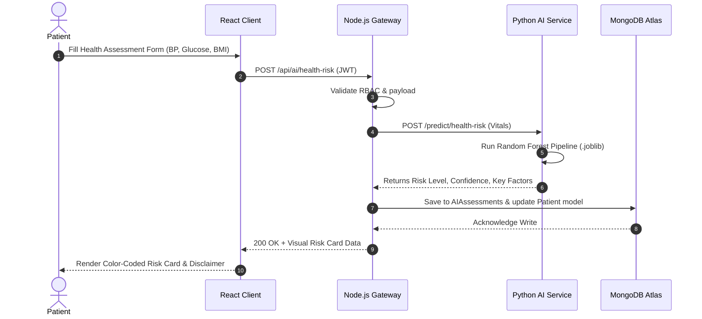

# System Architecture — CloudMed AI

## 1. High-Level Architectural Overview

CloudMed AI is structured as a distributed, loosely-coupled microservice architecture designed specifically for the academic curriculum **Artificial Intelligence on Cloud Computing**. It bridges hospital operations management with predictive machine learning and cloud document persistence.

```
                           INTERNET
                              │
                              ▼
                    ┌───────────────────┐
                    │   React Frontend  │
                    │ Vite + Tailwind   │
                    └─────────┬─────────┘
                              │
                         REST APIs (JWT)
                              │
                              ▼
                    ┌───────────────────┐
                    │ Node.js / Express │
                    │   Backend API     │
                    └───┬───────────┬───┘
                        │           │
            JSON Models │           │ File Upload Streams
                        ▼           ▼
                 ┌───────────┐ ┌────────────────┐
                 │  MongoDB  │ │  Cloudinary    │
                 │   Atlas   │ │  File Storage  │
                 └───────────┘ └────────────────┘
                        │
                        │ Internal Microservice HTTP
                        ▼
             ┌─────────────────────┐
             │   Python FastAPI    │
             │   AI / ML Service   │
             └──────────┬──────────┘
                        │
         ┌──────────────┴──────────────┐
         ▼                             ▼
┌──────────────────┐          ┌──────────────────┐
│ Health Risk ML   │          │ Priority ML      │
│ (Random Forest)  │          │ (Classifier)     │
└──────────────────┘          └──────────────────┘
         │                             │
         └──────────────┬──────────────┘
                        ▼
             ┌─────────────────────┐
             │   Clinical Report   │
             │     Summarizer      │
             └─────────────────────┘
```

---

## 2. Component Descriptions

### A. Client Tier (React 18 + Vite + Tailwind CSS)
- **Role:** Single Page Application (SPA) providing role-tailored dashboards for Administrators, Doctors, and Patients.
- **Key Modules:**
  - Responsive layout with desktop side navigation and mobile drawer.
  - Interactive Recharts KPI data visualizations (Donut, Bar, Multi-line).
  - Micro-interactions: modal wizards, dynamic badge indicators, and 1-click evaluation demo credential switchers.
  - Real-time client state managed via `AuthContext` with JWT session persistence.

### B. Business Logic & Gateway Tier (Node.js + Express.js)
- **Role:** Central REST API gateway managing security, RBAC, domain entities, and database transactions.
- **Key Responsibilities:**
  - Authentication via `bcryptjs` (salt factor 10) and JSON Web Tokens.
  - Role-based authorization middleware (`authenticateUser`, `authorizeRoles`).
  - Scheduling conflict detection: evaluates doctor schedules to prevent double booking.
  - Multi-part file upload processing with Cloudinary streaming and local sandbox fallback.
  - Proxies inference requests to the Python AI service.

### C. Artificial Intelligence & Analytics Tier (Python 3.x + FastAPI)
- **Role:** Independent microservice hosting Scikit-Learn machine learning pipelines and clinical NLP parsing.
- **Key Models:**
  - **Health Risk Assessment:** Pre-trained Random Forest model (`health_risk_model.joblib`) evaluating metabolic vitals (Accuracy: 83.00%).
  - **Appointment Priority Triage:** Pre-trained classification model (`priority_model.joblib`) scoring patient acuity into LOW, MEDIUM, and HIGH tiers (Accuracy: 86.40%).
  - **Report Summarizer:** Rule-assisted extractive NLP parser structuring unstructured medical narratives into Symptoms, Key Findings, and Urgency.

### D. Cloud Storage Tier (MongoDB Atlas & Cloudinary)
- **MongoDB Atlas:** Fully-managed cloud NoSQL document database hosting users, appointments, medical records, and AI assessment logs.
- **Cloudinary:** Cloud asset CDN storing diagnostic imaging and laboratory PDFs without burdening MongoDB with binary blobs.

---

## 3. Data & Communication Flow


